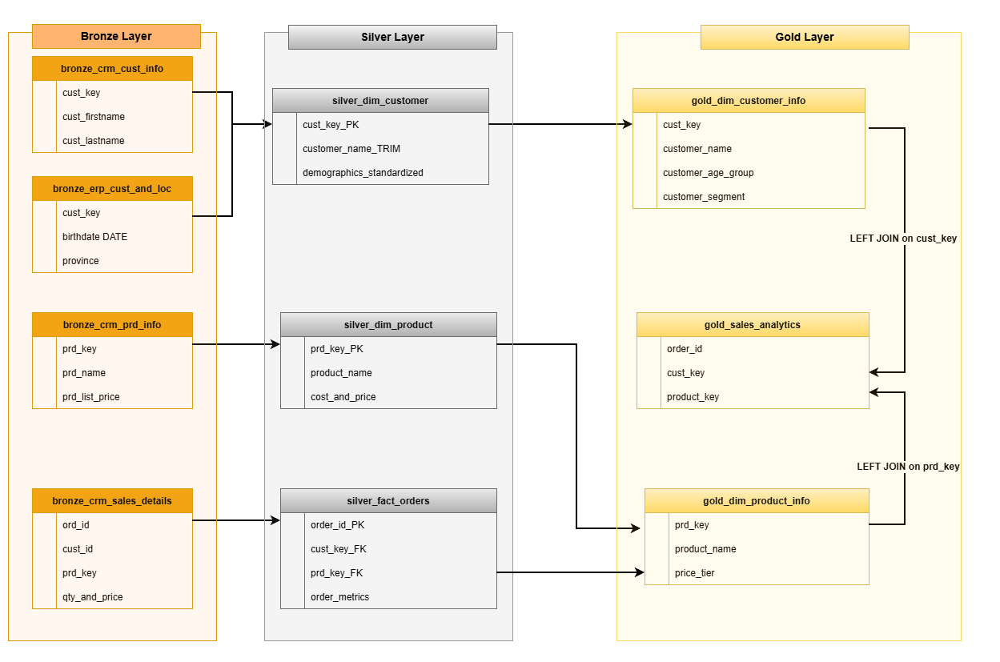
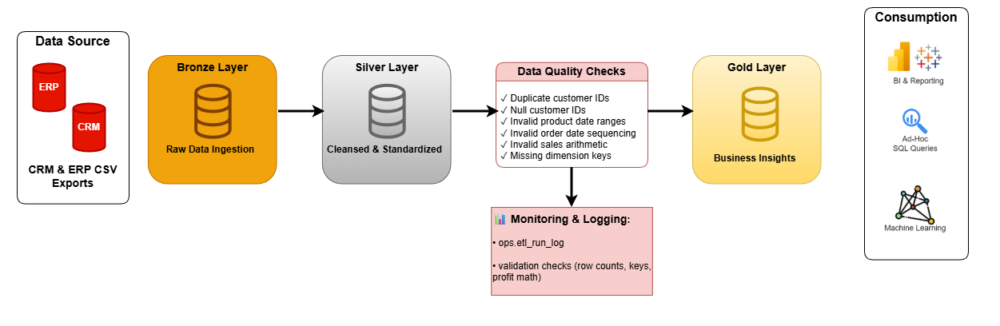
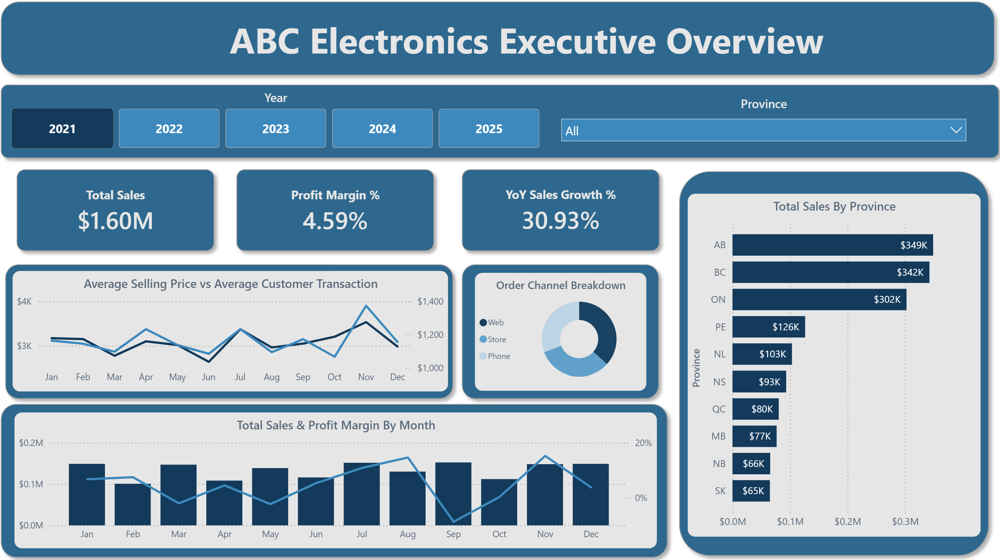
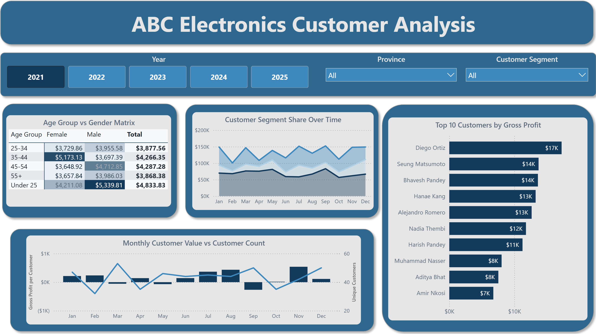
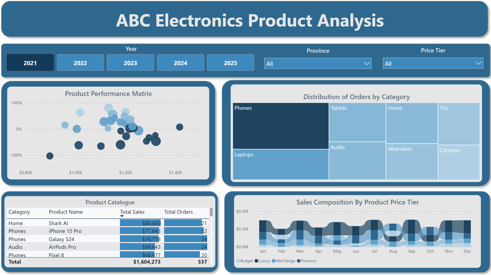
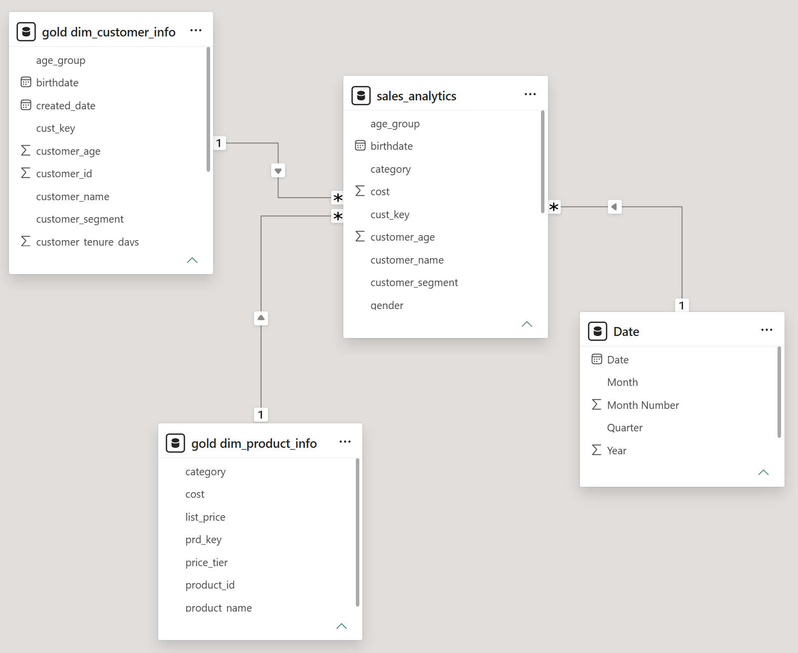

## Enterprise Sales Analytics Platform

ABC Electronics struggles to organize CRM and ERP data into one reliable reporting flow. This project resolves that with a SQL Server medallion pipeline that cleans the raw CSV exports and publishes a Power BI-ready Gold reporting view.

> TL;DR: Enterprise Sales Analytics Platform — a SQL Server medallion pipeline (Bronze → Silver → Gold) that ingests CSV exports, applies deterministic cleaning and deduplication in the Silver layer, and exposes a Power BI-ready `gold.sales_analytics` view for reporting and automated validation.

## What this project shows

- Bronze: built repeatable ingestion from CRM and ERP CSV exports into raw staging tables.
- Silver: cleaned, deduplicated, and enriched customer, product, and order data in SQL Server.
- Gold: published one reporting view, `gold.sales_analytics`, for Power BI and KPI validation.
- Power BI: built executive, customer, and product pages from the same semantic model.

## Why it matters

ABC Electronics needed one reliable reporting path instead of scattered spreadsheets and conflicting ad-hoc queries.

| Problem | Solution |
|---|---|
| Multiple spreadsheet extracts produced different numbers. | Bronze keeps the source files and Silver standardizes the data so every run starts from the same raw inputs. |
| Reporting logic was hard to trust and harder to repeat. | Gold publishes one reporting view, `gold.sales_analytics`, that Power BI and validation checks both use. |
| The business needed faster KPI review with less manual work. | The pipeline is repeatable end to end, so the same load can be run and checked again at any time. |

## Pipeline overview


The first image shows the full medallion flow from source files to the reporting layer, while the second image shows the supporting warehouse layout behind it.



_Bronze keeps the source files, Silver prepares the data, and Gold publishes the reporting layer._

The supporting architecture diagram shows how CRM and ERP files move from Bronze into Silver and then into the Gold reporting layer.



_Architecture view of the full Bronze → Silver → Gold flow._

## Data Modeling & Warehouse Design

To support scalable reporting and fast analytical queries, the Silver layer uses a simple star schema (one fact table + supporting dimensions).

- `silver.fact_orders`: transaction-grain fact table (one row per order line) storing keys to dimensions and numeric measures (`unit_price`, `cost`, `qty`).
- `silver.dim_customer`: cleaned and standardized customer attributes used across reports (`cust_key`, `name`, `tier`, `signup_date`).
- `silver.dim_product`: standard product attributes (`prd_key`, `sku`, `category`, `cost_basis`).

Gold is a presentation layer: `gold.sales_analytics` flattens selected dimensions into a single view optimized for Power BI (fewer joins, pre-calculated measures where appropriate).

Design rationale: using a star schema in Silver keeps ETL predictable, makes handling slowly changing attributes straightforward, and centralizes join keys for reporting.

## Layer details (Bronze → Silver → Gold)

- Bronze: raw landing area that preserves source CSVs and minimal transformation. Bronze tables mirror the incoming files to retain provenance and allow re-processing.
- Silver: cleaned, standardized, and de-duplicated domain tables that provide stable keys and business-ready attributes for reporting. See the "Silver Data Quality Rules" section for the exact checks applied.
- Gold: presentation-ready views (for example, `gold.sales_analytics`) that denormalize selected Silver tables into flat structures optimized for Power BI consumption.


## Report pages

The Power BI report is organized into three pages:

These screenshots show the executive summary, the customer analysis page, and the product analysis page. Together they show how the same Gold model supports different views of the business.

<table>
	<tr>
		<th align="center">Executive</th>
		<th align="center">Customer</th>
		<th align="center">Product</th>
	</tr>
	<tr>
		<td align="center"></td>
		<td align="center"></td>
		<td align="center"></td>
	</tr>
	<tr>
		<td align="center">Top-line KPI view for a fast business check.</td>
		<td align="center">Customer ranking, concentration, and segment analysis.</td>
		<td align="center">Product mix, price, and margin pressure by SKU.</td>
	</tr>
</table>

The report is built on `gold.sales_analytics` and focuses on a small, well-defined measure set described below.

## Power BI Semantic Model

The Power BI semantic model (see image below) uses Gold presentation tables plus a Date table to power the report pages. Key elements visible in `images/pbi_semantic_model.png`:

- `gold.dim_customer_info`: `cust_key`, `customer_name`, `customer_segment`, `customer_age`, `gender`, `birthdate`, `created_date`
- `gold.dim_product_info`: `prd_key`, `product_name`, `category`, `cost`, `list_price`, `price_tier`
- `Date` table: `Date`, `Month`, `Month Number`, `Quarter`, `Year`
- `sales_analytics` (Gold view): measures and denormalized attributes such as `cust_key`, `category`, `cost`, `customer_age`, `customer_name`, `customer_segment`, `birthdate`, and `age_group`

Relationships are standard lookup cardinalities from the dimension tables and `Date` into the `sales_analytics` view (1 → *); the model keeps calculations in Gold so visuals can use thin, auditable measures.



_Power BI semantic model showing Gold dimensions, Date table, and the `sales_analytics` view._

## Metric Definition Schema

| Metric Name | Calculation (SQL logic) | Business Context |
|---|---|---|
| Gross Profit | `(unit_price - cost) * qty` | Realized dollar margin per line item |
| Profit Margin % | `SUM((unit_price - cost) * qty) / NULLIF(SUM(unit_price * qty),0)` | Percent margin for category/product comparisons |
| Total Sales | `SUM(unit_price * qty)` | Revenue recognized at line level |
| Total Orders | `COUNT(DISTINCT order_id)` | Order volume for period analysis |
| Unique Customers | `COUNT(DISTINCT cust_key)` | Customer base size; used for per-customer metrics |


Include these definitions in the semantic model to keep visual calculations thin and auditable.

## Main data flow

Source files live in `data/crm/` and `data/erp/`. Bronze tables hold the raw customer, product, sales, demographics, and location data. Silver tables create the cleaned customer dimension, product dimension, and order fact table. Gold exposes the reporting view `gold.sales_analytics` for Power BI and validation.

## Silver Data Quality Rules

The Silver layer enforces explicit production-grade quality rules so the Gold view is auditable and repeatable:

- Idempotence: transformations are transaction-safe and designed to be re-run without producing duplicates (staging truncation + `BEGIN TRAN` / `TRY...CATCH` with explicit `THROW` on failure).
- Deduplication: deterministic windowing (`ROW_NUMBER() OVER (PARTITION BY <business_key> ORDER BY last_modified DESC)`) retains the latest active record per entity.
- Referential Integrity: fact tables are validated to ensure `cust_key` and `prd_key` reference existing dimension keys (DQ checks flag orphaned keys).
- String normalization: trimming, case normalization, and deterministic mapping of common variants (e.g., `M|Male|MALE` → `Male`).
- Business constraints: numeric ranges and nullability checks (prices >= 0, qty > 0) to catch malformed source rows before they reach Gold.

These rules are implemented in `sql/02_silver/transform_data.sql` and are surfaced in the automated validation step.

## Run it locally

The default setup uses SQL Server on `.\SQLEXPRESS` and database `DWH`.

```powershell
cd C:\enterprise-sales-analytics-platform
.\run_pipeline.ps1
```

To target a different server or database:

```powershell
.\run_pipeline.ps1 -ServerName "MY-SERVER\INSTANCE" -DatabaseName "DWH"
```

The script creates the database and schemas on first run, then loads Bronze, transforms Silver, and publishes Gold views.

The PowerShell wrapper acts as a lightweight CI/CD orchestrator: it sequences `sqlcmd` calls, surfaces errors for CI, and provides a repeatable local run experience across environments.

## System requirements

- Windows with PowerShell and `sqlcmd` on PATH.
- SQL Server Express or full SQL Server.
- Permission to create databases, schemas, and bulk load data.
- Power BI Desktop if you want to edit or republish the report.

## Automated Data Quality (DQ) Testing

Run the quick checks after the pipeline finishes. The validation step performs automated DQ tests including layer counts, referential integrity, and KPI sanity checks:

- Layer counts: ensure row counts progress sensibly from Bronze → Silver → Gold.
- Referential integrity: detect `cust_key`/`prd_key` orphans in fact tables.
- KPI sanity: compare top-line totals (e.g., `Total Sales`, `Gross Profit`) against expected thresholds to catch major regressions.

Run the checks with:

```powershell
sqlcmd -S ".\SQLEXPRESS" -d "DWH" -E -i sql/validation/quick_checks.sql
```

The `sql/validation/quick_checks.sql` script contains the reference SQL for these tests and is intended as a minimal, reproducible smoke-test for CI.

## Repository materials

- `run_pipeline.ps1` - pipeline orchestrator.
- `sql/` - Bronze, Silver, Gold, and validation SQL.
- `powerbi/` - Power BI report and semantic model.
- `images/` - pipeline diagrams and report screenshots.
- `draw.io/` - editable diagram template.

## Notes

- The report reads from the Gold layer, not directly from the raw CSVs.
- If bulk load rights are unavailable, create the database first and run the SQL scripts against it.
- The sample CSVs are test data and may include names and emails.


